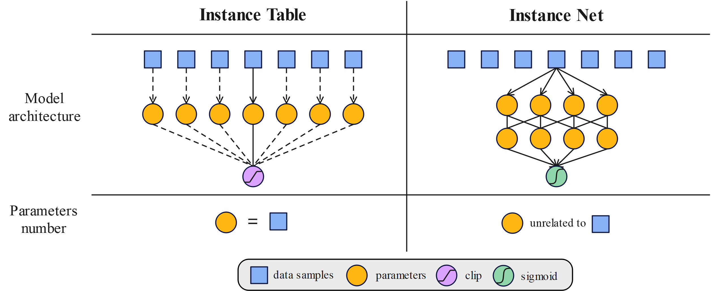

# OraclePRM: Unlocking the Potential of Each Instance for Multimodal Process Reward Model Training
This repository holds the code and data of [OraclePRM: Unlocking the Potential of Each Instance for Multimodal Process Reward Model Training](https://arxiv.org/abs/2505.20241).

## News 🚀🚀🚀
* Update on Sep 5, 2025: release codes, checkpoints and paper

## Abstract
> **OraclePRM: Unlocking the Potential of Each Instance for Multimodal Process Reward Model Training**  
> Training multimodal process reward models (PRMs) is challenged by distribution shifts and noisy data. We introduce OraclePRM, an instance-reweighted framework that adaptively adjusts the importance of each training example via bi-level optimization. 
> We design two complementary strategies: Instance Table, effective for smaller datasets, and Instance Net, scalable to larger ones. 
> Integrated into test-time scaling, OraclePRM achieves 84.6 accuracy on the MMMU benchmark, surpassing GPT-5-mini. Moreover, a sanity check using test-distribution meta data shows OraclePRM can closely approach oracle-level performance, highlighting its potential to fully exploit each training instance.

## Table of Contents
1. [Overview](#installation)
2. [Model Checkpoints](#checkpoints)
3. [Quick Start](#quick-start)
4. [Acknowledgement](#acknowledgement)
5. [License](#license)
6. [Citation](#citation)

## Overview <a name="installation"></a>
We propose OraclePRM, an *instance-reweighted* multimodal process reward model training framework that dynamically adjusts the weight of each individual data example. To realize instance-level reweighting, we further design two complementary training paradigms: Instance Table, which maintains more activated parameters during training and proves effective for smaller datasets; and Instance Net, which employs a lightweight parameterization with stronger generalization ability, making it more suitable for large-scale training set (See the figure below).


By integrating OraclePRM into test-time scaling, we achieve a new state-of-the-art accuracy of 84.6 on the validation set of MMMU benchmark, further advancing the performance frontier of the strongest existing model, GPT-5-mini. Moreover, we conduct a thorough sanity check on instance reweighting, which highlights OraclePRM’s potential to approach oracle-level performance under test-time scaling.

| Category | Model / Method |     Accuracy |
|---|---|-------------:|
| **Leaderboard (external, top-performing models)** | GPT-5 w/ thinking |         84.2 |
|  | Gemini 2.5 Pro Deep-Think |         84.0 |
|  | o3 |         82.9 |
| **OraclePRM (built on GPT-5-mini w/ thinking)** | Base: GPT-5-mini w/ thinking |         80.0 |
|  | OraclePRM — Instance Table |  84.6 (+4.6) |
|  | OraclePRM — Instance Net |  83.6 (+3.6) |
|  | OraclePRM — Instance Table (sanity check) | 90.4 (+10.4) |
|  | OraclePRM — Instance Net (sanity check) |  86.3 (+6.3) |
|  | Oracle (upper bound) |         90.7 |

## Model Checkpoints <a name="checkpoints"></a>
| Model                   | Hugging Face Link                                                             |
|-------------------------|-------------------------------------------------------------------------------|
| OrcalePRM-InstanceTable | [🤗 Checkpoint link](https://huggingface.co/Cooolder/OrcalePRM-InstanceTable) |
| OrcalePRM-InstanceNet   | [🤗 Checkpoint link](https://huggingface.co/Cooolder/OrcalePRM-InstanceNet)   |

## Quick Start <a name="quick-start"></a>
> *All commands below are illustrative—rename scripts / paths to match your repo.*
### 1. Codes
Git clone our repository, creating a python environment and ativate it via the following command

```bash
git https://github.com/coder-qicao/OraclePRM.git
cd OraclePRM
```

### 2. Environment

```bash
# (a) create conda env
conda create -n oracleprm python=3.10 -y
conda activate oracleprm

# (b) install requirements
pip install -r requirements.txt   # torch betty-ml, transformers, accelerate, ...
```
Verify the installation of `torch` and `torchvision` is successful by running `python -c "import torchvision; print(torchvision.__version__)"`. If it outputs the version number without any warnings or errors, then you are good to go. __If it outputs any warnings or errors__, try to uninstall `torch` by `conda uninstall pytorch torchvision torchaudio cudatoolkit` and then reinstall them following [here](https://pytorch.org/get-started/previous-versions/#v1121). You need to find the correct command according to the CUDA version your GPU driver supports (check `nvidia-smi`). 

### 3. Instance-reweighting
The current version of OraclePRM is built on InternVL3-1B.
Please download InternVL3-1B weights from [🤗InternVL3-1B](https://huggingface.co/OpenGVLab/InternVL3-1B).

Instance-reweighting for OraclePRM fine-tuning:
```bash
# cold start
bash run_coldstart.sh
# Instance-Table or Instance-Net
bash run_table.sh
bash run_net.sh
```
**You need at least 80 GB GPU memory for the training.** 

Best-of-N selection using re-trained PRM:

Use the re-trained PRM to select the most promising CoT among the candidates. Try different **aggregation functions**—such as mean, log-mean, or other variants—to evaluate and aggregate step-level scores effectively.
```bash
python test.py
```


### 4. Configuration Parameters
### Data file path and model path
| Parameter | Type | Default | Description |
|-----------|------|---------|-------------|
| `--train_json_file` | str | `"./data/train.json"` | Training data file path |
| `--meta_json_file` | str | `"./data/meta.json"` | Meta data file path |
| `--test_json_file` | str | `"./data/test_MMMU.json"` | Test data file path |
| `--weights_path` | str | `"./weights"` | Model weights path |
| `--reward_model` | str | `"OpenGVLab/InternVL3-1B"` | Reward model |

---

### Bi-level optimization configuration
| Parameter | Type | Default | Description |
|-----------|------|---------|-------------|
| `--iteration_num` | int | 100000 | Total iterations |
| `--save_every_iterations` | int | 1 | Save frequency |
| `--unroll_steps` | int | 1 | Unroll steps |
| `--gradiant_accumulation` | int | 1 | Gradient accumulation steps |
| `--gradiant_clipping` | float | 1.0 | Gradient clipping value |
| `--device` | str | `"cuda"` | Device type |
| `--precision` | str | `"bf16"` | Precision mode |
| `--strategy` | str | `"default"` | Training strategy |
| `--rollback` | flag | False | Enable rollback |
| `--baseline` | flag | False | Use baseline |
| `--seed` | int | 1 | Random seed |
| `--local_rank` | int | 0 | Local rank for distributed training |

---

### Lower-level optimization hyperparameters
| Parameter | Type | Default | Description |
|-----------|------|---------|-------------|
| `--lr` | float | 5e-5 | Learning rate |
| `--momentum` | float | 0.9 | Optimizer momentum |
| `--weight_decay` | float | 0.01 | Weight decay |
| `--batch_size` | int | 1 | Batch size |
| `--scheduler_step_size` | int | 1000 | Scheduler step size |
| `--scheduler_gamma` | float | 0.95 | Scheduler decay factor |

---

### Upper-level optimization hyperparameters
| Parameter | Type | Default | Description |
|-----------|------|---------|-------------|
| `--meta_lr` | float | 1e-1 | Meta learning rate |
| `--meta_momentum` | float | 0.9 | Meta optimizer momentum |
| `--meta_weight_decay` | float | 1e-3 | Meta weight decay |
| `--meta_batch_size` | int | 1 | Meta batch size |
| `--meta_scheduler_step_size` | int | 1000 | Meta scheduler step size |
| `--meta_scheduler_gamma` | float | 0.95 | Meta scheduler decay factor |

---

### Other important parameters
| Parameter | Type  | Default | Description                                           |
|-----------|-------|---------|-------------------------------------------------------|
| `--retrain` | bool  | False | Retrain flag                                          |
| `--activation_function` | str   | `"LeakyReLU"` | Activation function (LeakyReLU \| ReLU \| No \| Clip) |
| `--aggregation_function` | str   | `"mean"` | Aggregation function (mean \| max \| min \| log_mean) |
| `--loss_target` | str   | `"both"` | Loss target (+ \| both)                               |
| `--initialization` | float | 1.0 | Initialization value                                  |
| `--max_patch_num` | int   | 6 | Maximum patch number                                  |
| `--scheduler_type` | str   | `"cosine_schedule_with_warmup"` | scheduler type  |                                      |

---
## Acknowledgement <a name="acknowledgement"></a>

+ [DreamPRM](https://github.com/coder-qicao/DreamPRM)
+ [InternVL](https://github.com/OpenGVLab/InternVL)
+ [VisualPRM](https://internvl.github.io/blog/2025-03-13-VisualPRM/)
+ [Betty](https://github.com/leopard-ai/betty)
+ [MMMU](https://mmmu-benchmark.github.io/)

## License <a name="license"></a>
This repository is under [Apache License 2.0](LICENSE.md).


## Citation <a name="citation"></a>
If you use this work in your research, please cite:
```bibtex
@misc{cao2025dreamprmdomainreweightedprocessreward,
      title={DreamPRM: Domain-Reweighted Process Reward Model for Multimodal Reasoning}, 
      author={Qi Cao and Ruiyi Wang and Ruiyi Zhang and Sai Ashish Somayajula and Pengtao Xie},
      year={2025},
      eprint={2505.20241},
      archivePrefix={arXiv},
      primaryClass={cs.LG},
      url={https://arxiv.org/abs/2505.20241}, 
}
```

